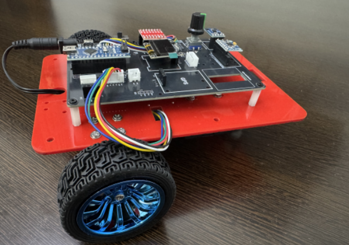

# ZAS Robotics Navigational Robot – Car-3  
### Advanced Autonomy Edition (Encoders + IMU + GPS)

---

## About This Robot
The **ZAS Robotics Car-3 (Advanced Autonomy Edition)** is the most powerful robot in the ZAS Navigational Series.  
It is designed for **university engineering labs, robotics research teams, AI/ML learners, and advanced autonomy courses**.

Car-3 brings together a high-precision sensor suite with a stable motion platform, enabling hands-on learning in:

- Autonomous Navigation  
- Sensor Fusion  
- Control Theory  
- Robotics Algorithms  
- Outdoor & Indoor Localization  
- Research Prototyping  

It is ideal for students who want to understand how real autonomous robots — such as AGVs, UAVs, warehouse robots, and research platforms — perform localisation, mapping, and control.

---

## Key Learning Outcomes
With Car-3, learners can explore and implement:

- **Odometry** using dual wheel encoders  
- **IMU Drift Correction** and orientation estimation  
- **Compass-based heading stabilisation**  
- **GPS-based outdoor navigation** (waypoints & tracking)  
- **Sensor fusion** (Complementary Filter, Kalman Filter, Extended Kalman Filter)  
- **PID control** for speed + heading  
- **Trajectory planning** and path modelling  
- **Reinforcement Learning data collection**  
- **Research experimentation** in dynamics, filtering, and motion modelling  

Car-3 provides both **hardware precision** and **algorithm flexibility**, making it a true research-grade learning tool.

---

## What’s Included in the Car-3
The Car-3 platform is delivered **fully assembled**, **wired**, and **lab-ready**.

### Core Robot Platform
- Fully assembled Car-3 robot  
- **2 × DC-370 high-precision encoder motors**  
- Rear caster wheel for stability  
- Integrated power distribution board  
- Clean JST wiring for plug-and-play operation  

### Advanced Sensor Suite
- **MPU6050 6-axis IMU** (accelerometer + gyroscope)  
- **QMC5883 3-axis digital compass**  
- **NEO-6M GPS module** with antenna  
- **Rotary encoder module**  
- Precision dual encoder motors (left + right)  

### Interface & Feedback
- **0.96” OLED display** showing telemetry:  
  - Speed  
  - Heading  
  - IMU & compass data  
  - GPS lock status  
  - Encoder counts  

### Power System
- 18650 battery holder  
- Dedicated 18650 charger  
- Regulated 5V and 3.3V rails  
- Noise-filtered sensor power  

### Software & Documentation Pack
Includes a complete set of learning and testing resources:

- Sensor diagnostic codes  
- IMU/Compass/GPS example scripts  
- Odometry and control examples  
- Sensor fusion templates  
- Wiring diagrams  
- Pinout documentation  
- Board layout diagrams  

All materials are structured for students, teachers, and researchers.

---

## Ideal For
- B.Tech / M.Tech engineering programs  
- University robotics & AI research labs  
- Innovation labs & maker spaces  
- Capstone and final-year projects  
- Autonomous robotics courses  
- It gives foundation for UAV/UGV research  
- Early SLAM/EKF experimentation  
- Reinforcement Learning projects  

Car-3 is built to support both **structured learning** and **open-ended research**, making it a unique high-value platform for advanced autonomy.

---

## Learn, build, test, and innovate with ZAS Robotics Car-3 — the complete learning and research robot for modern autonomy.
